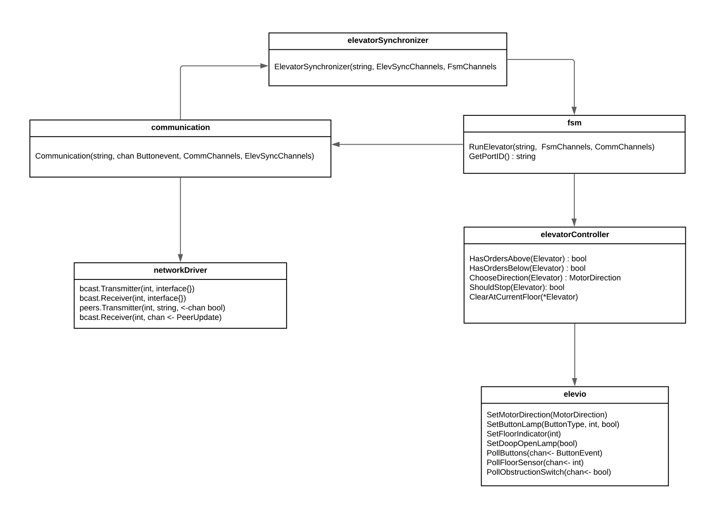

**TTK4145 Sanntidsprogrammering - Elevator project** 
--------------------------------------------------

*Our project consists of six modules and a config file*
- elevatorSynchronizer
- communication
- fsm 
- elevatorController
- networkDriver
- elevio

*Used libraries we have not developed*
- cost_fns
- networkDriver
- elevio

The three first mentioned modules are for-select loops with channel interface. The fsm module determines the behaviour of a elevator. Furthermore the elevatorController uses elevio functionality to determine the next action based on the current elevator state. Elevio sensors the changes in the simulator writing to channels. The documentation of elevio can be found [here](https://github.com/TTK4145-Students-2021/driver-go). Fsm- and elevatorController code are inspired by the elev_algo directory [(link)](https://github.com/TTK4145/Project-resources). 

The interactions between elevators are broadcasted over network using udp protocoll. This functionality is found in the networkDriver module and is based on the given driver in the course [(link)](https://github.com/TTK4145-Students-2021/Network-go). The communication module utilises the networkDriver controlling the interactions. Finally the elevatorSynchronizer distributes orders based on information from all elevators on network. The module uses the given algorithm hall_request_assigner found in the same repository as elev_algo.  

